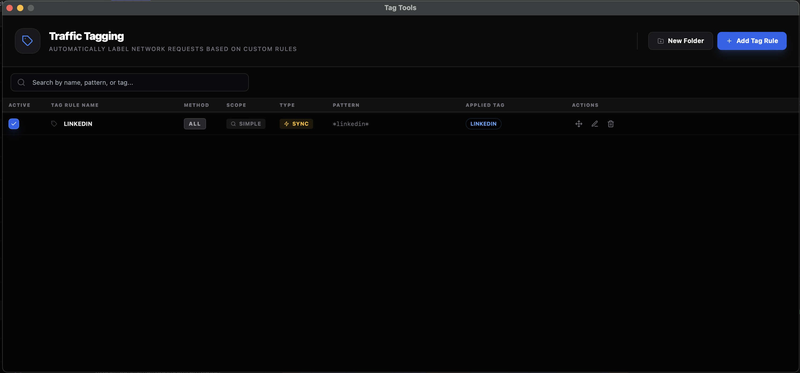
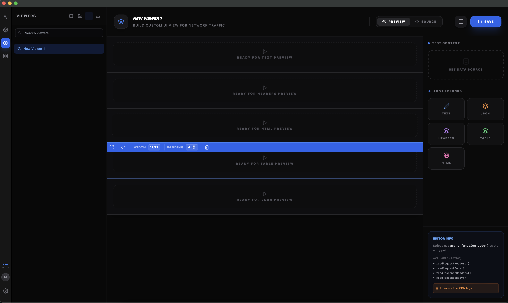

# ✨ Network Spy Features

  

**Network Spy** is designed around a core philosophy: **Viewers are a Superpower.** Our tools are built to help you understand complex data, not just capture it.

---

## 💎 Specialized Viewers
Modern applications use non-standard transport methods. Network Spy provides high-fidelity viewers for each one:

### 🧬 GraphQL Inspector
Deeply parses queries, variables, and extensions. 
- **Batched Operations**: Switch between multiple operations in a single POST request.
- **Persisted Queries**: Automatically detects and labels ID-based requests.
- **Extensions**: View implementation-specific metadata (Apollo cache, tracing, etc.).
- **Responsive Layout**: Adjusts to your workspace with a focused tabbed or side-by-side grid view.

### 🧠 LLM Token Analyzer (SSE)
The first specialized tool for AI developers. 
- **Real-time Cost Analysis**: Tracks streaming tokens and latency for OpenAI, Anthropic, and custom LLM providers.
- **Execution Traces**: View full prompt/completion flows with detailed timing metadata.

### 📄 Form Data + JSON Decoder
Decodes URL-encoded payloads and automatically beautifies any embedded JSON strings found within form fields.

### 📦 Multipart Form Visualizer
Easily navigate massive binary uploads.
- **Searchable Sidebar**: Quickly jump between form fields and metadata.
- **High-Performance Preview**: View images, videos, and large text blobs using an integrated Monaco editor.

---

## 🛠️ Management & Automation

### 🏷️ Intelligent Tagging
Categorize traffic automatically using a robust tagging system. 
- **Search & Filter**: Find Ads, Analytics, or specific API domains in seconds.
- **Persistence**: Your tags are saved across sessions, building a searchable history of your environment.
 

  

### 🎨 Custom Viewer Engine
The ultimate flexibility tool. Use a drag-and-drop block builder to create custom visualizers for your proprietary protocols or business data models.
 

  

### 🔒 Automated Security Context
Decryption of HTTPS traffic requires a root certificate. Network Spy handles this with a one-click automated setup for:
- macOS
- Windows (PowerShell)
- Linux (GNOME/GTK/System-Wide)

---

## 📦 Traffic Flow & Export
- **HAR Export/Import**: Compatible with all major dev tools.
- **SQLite Database**: Native storage for high-performance session management and forensic analysis.
- **Filter Presets**: Save and manage your favorite filtering rules to cut through the noise.

---

[Back to main README](./README.md)
