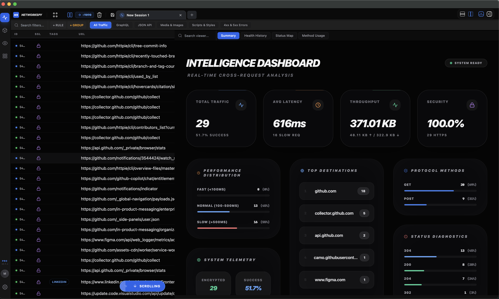
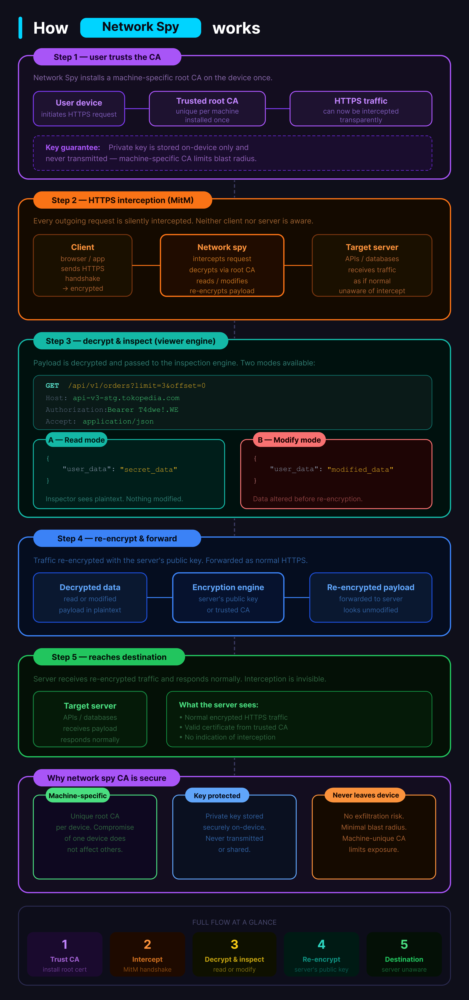
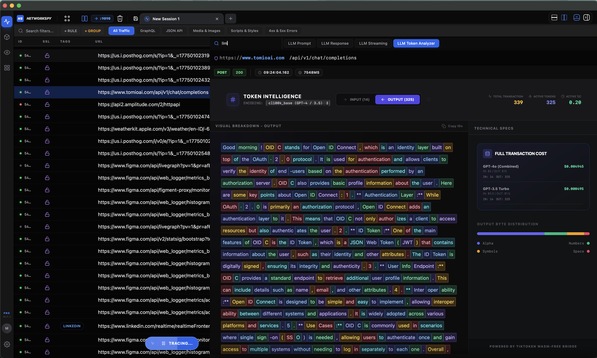

<p align center>
  
</p>

<h1 align center>📡 Network Spy</h1>

<p align center>
  <strong>The premium, high-performance HTTP/HTTPS proxy and traffic analyzer built for the modern web.</strong>
</p>

<p align center>
  <a href="https://github.com/muizidn/NetworkSpy-Tauri/releases">
    
  </a>
  <a href="https://github.com/muizidn/NetworkSpy-Tauri/releases">
    
  </a>
</p>

---

⭐ **Star us on GitHub** — your support motivates us to build more "Superpowers" for your dev workflow! 🙏😊

---

## 📖 Table of Contents
- [🚀 About](#-about)
- [⚙️ How it Works](#%EF%B8%8F-how-it-works)
- [✨ Key Features](#-key-features)
- [⚡ Quick Install](#-quick-install)
- [🛡️ Trust & Security](#-trust--security)
- [🛠️ Development Setup](#-development-setup)

---

<p align center>
  
</p>

## 🚀 About
**Network Spy** is a cross-platform Network Proxy and Traffic Analyzer built with **Tauri**, **Rust**, and **React**. It intercepts, decrypts, and analyzes your application's network traffic with a stunning, high-performance interface. 

Our goal is to move beyond simple "packet capturing" and provide a tool that truly understands the data being sent across the wire.

---

## ⚙️ How it Works

Network Spy operates as a **Man-in-the-Middle (MITM)** proxy. It sits between your application and the internet, intercepting traffic to provide deep visibility.

1. **Proxy Interception**: The app starts a high-performance Rust-based proxy server on your local machine.
2. **HTTPS Decryption**: By installing the optional **Network Spy Root CA**, the app can securely decrypt HTTPS traffic using industry-standard certificate pinning bypass techniques.
3. **Capture & Analyze**: Traffic is captured in real-time and passed through our specialized **Superpower Viewers** for automated decoding of GraphQL, LLM streams, Protobuf, and more.
4. **Local Forever**: All data is analyzed and stored locally in a high-speed SQLite database. No traffic ever leaves your machine.

<p align center>
  
</p>

---

## ✨ Key Features
Network Spy is designed around a core philosophy: **Viewers are a Superpower.** 

- **🚀 High Performance**: Rust-powered proxy engine for zero-latency traffic interception.
- **🎨 Premium UI**: A modern, dark-themed interface built for modern developers.
- **🧬 GraphQL Inspector**: Deeply parses queries, variables, and extensions with batched operation support.
- **🧠 LLM Token Analyzer**: The first specialized tool for AI/ML developers to track token costs and stream latency.
- **🏷️ Intelligent Tagging**: Automatically categorize and search through thousands of requests.
- **📦 Custom Viewer Engine**: Build your own visualizers with a drag-and-drop block builder.

👉 [**Explore all features in detail here**](./FEATURES.md)

<p align center>
  
</p>

---

## ⚡ Quick Install

The fastest way to install or update Network Spy is via the terminal (Stable Releases):

###  macOS / 🐧 Linux
```bash
curl -fsSL https://raw.githubusercontent.com/muizidn/NetworkSpy-Tauri/develop/install.sh | sh
```

### 🪟 Windows (PowerShell)
```powershell
iwr -useb https://raw.githubusercontent.com/muizidn/NetworkSpy-Tauri/develop/install.ps1 | iex
```

### 🧪 Bleeding Edge (Develop Builds)
If you want the latest features from the `develop` branch before they are officially released:

#### macOS / Linux
```bash
curl -fsSL https://raw.githubusercontent.com/muizidn/NetworkSpy-Tauri/develop/install-dev.sh | sh
```

#### Windows (PowerShell)
```powershell
iwr -useb https://raw.githubusercontent.com/muizidn/NetworkSpy-Tauri/develop/install-dev.ps1 | iex
```

---

## 🛡️ Trust & Security
- **One-Click CA Setup**: Automated root certificate installation for HTTPS interception.
- **Local Analysis**: All decryption happens on your machine. No traffic ever leaves your device.
- **High Performance**: Rust-powered proxy engine ensures zero-latency interception.

---

## 🛠️ Development Setup

1. **Clone**: `git clone https://github.com/muizidn/NetworkSpy-Tauri.git`
2. **Install**: `bun install`
3. **Run Dev**: `bun run tauri dev`
4. **Build**: `bun run tauri build`

---

[Back to top](#-network-spy)
